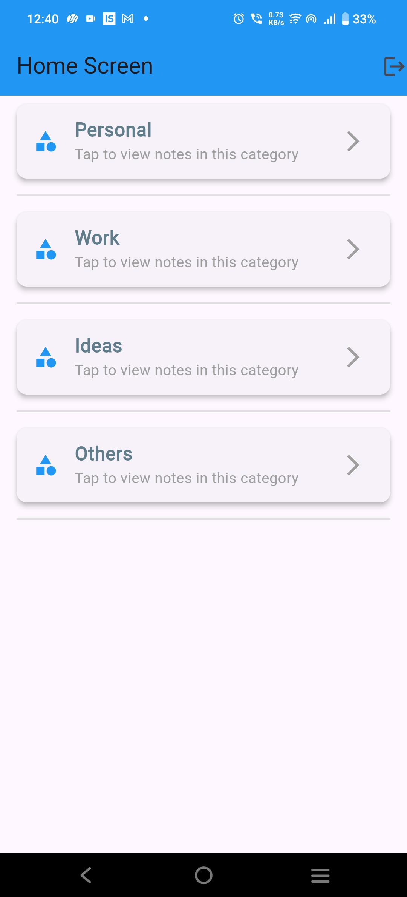

# notes_app

A new Flutter project.

## Getting Started

This project is a starting point for a Flutter application.

A few resources to get you started if this is your first Flutter project:

- [Lab: Write your first Flutter app](https://docs.flutter.dev/get-started/codelab)
- [Cookbook: Useful Flutter samples](https://docs.flutter.dev/cookbook)

For help getting started with Flutter development, view the
[online documentation](https://docs.flutter.dev/), which offers tutorials,
samples, guidance on mobile development, and a full API reference.
## Video Link

You can watch the demo of the project here:

[Demo Video](https://drive.google.com/file/d/1jd5n2FiSV05i1qi0h7S1XREGrbkEGAMT/view?usp=sharing)

## Screenshots

